[简体中文](./README.md) · [Website](https://mcpx.lei6393.com) · [GitHub](https://github.com/SuperMarioYL/mcpx)

<picture>
  <source media="(max-width: 600px) and (prefers-color-scheme: dark)" srcset="./assets/presentation/hero-mobile-dark.svg">
  <source media="(max-width: 600px)" srcset="./assets/presentation/hero-mobile-light.svg">
  <source media="(prefers-color-scheme: dark)" srcset="./assets/presentation/hero-dark.svg">
  
</picture>

# mcpx

**Write one MCP server entry across your clients.**

mcpx detects supported client configuration files, merges one stdio server definition into each selected client, and can launch the server for an initialize/tools-list smoke test.

## Why use it

Maintaining the same command, arguments and environment in several config schemas invites drift. A single ServerSpec gives those entries a common input while adapters own each file format.

- **One input definition** — Command, args and env feed each adapter.
- **Repeatable updates** — Equivalent server entries produce no write.
- **Backups before change** — Changed existing configs receive sibling backups.

## Architecture

<picture>
  <source media="(max-width: 600px) and (prefers-color-scheme: dark)" srcset="./assets/presentation/architecture-mobile-dark.svg">
  <source media="(max-width: 600px)" srcset="./assets/presentation/architecture-mobile-light.svg">
  <source media="(prefers-color-scheme: dark)" srcset="./assets/presentation/architecture-dark.svg">
  
</picture>

Client adapters resolve paths and schemas. The config writer backs up changed files, merges only the named entry, and treats repeated equivalent input as a no-op. add then launches the specified stdio command for a protocol smoke test; it does not start the client application itself.

| Component | Responsibility |
| --- | --- |
| `ServerSpec / catalog` | internal/catalog |
| `Client adapters` | internal/clients |
| `Backup + merge` | internal/config |
| `Stdio handshake` | internal/handshake |

## Install and quickstart

Use the runtime version declared in the repository manifest. The source installation below makes the included example reproducible.

```bash
git clone https://github.com/SuperMarioYL/mcpx.git
cd mcpx
go build ./cmd/mcpx
```

The Go example writes JSON and TOML fixtures, repeats each merge, reads the entries and removes them from its own temporary files.

```bash
go run ./examples/presentation
```

## Recorded demo

<picture>
  <source media="(max-width: 600px) and (prefers-color-scheme: dark)" srcset="./assets/presentation/process-mobile-dark.svg">
  <source media="(max-width: 600px)" srcset="./assets/presentation/process-mobile-light.svg">
  <source media="(prefers-color-scheme: dark)" srcset="./assets/presentation/process-dark.svg">
  
</picture>

Both adapters write one entry with a backup; the second merge is unchanged, and removal reports a change.

```text
claude-code: first_changed=true backup=true repeat_changed=false servers=1
claude-code: remove_changed=true
codex: first_changed=true backup=true repeat_changed=false servers=1
codex: remove_changed=true
```

The complete command and output are recorded in [docs/demo-results.json](./docs/demo-results.json). Inputs and reproduction code are included in the repository.


The existing recording is retained for context; the text example above documents the reproducible scenario.

## Usage

Run these commands from the repository root after installation. Replace paths for your own data.

```bash
go run ./cmd/mcpx catalog
go run ./cmd/mcpx add filesystem --clients claude-code,codex --dry-run
# Apply to your detected clients after reviewing the preview:
go run ./cmd/mcpx add filesystem --clients claude-code,codex
go run ./cmd/mcpx list
go run ./cmd/mcpx remove filesystem --dry-run
```

## Configuration

--clients accepts claude-code, claude-desktop, codex and cursor; absent configs are skipped. --dry-run previews without writes or handshake; --yes skips the write prompt. Custom servers use --command, a quoted --args string and repeated --env K=V. Environment entries are stored in client config; prefer the client/server credential mechanism suitable for your setup. Reload affected clients after a real change.

## Integrations and responsibilities

<picture>
  <source media="(max-width: 600px) and (prefers-color-scheme: dark)" srcset="./assets/presentation/integrations-mobile-dark.svg">
  <source media="(max-width: 600px)" srcset="./assets/presentation/integrations-mobile-light.svg">
  <source media="(prefers-color-scheme: dark)" srcset="./assets/presentation/integrations-dark.svg">
  
</picture>

Choose the input and output route that matches your workflow. The local example below exercises the stated subset.

| Route | Implemented role |
| --- | --- |
| Claude Code / Desktop | mcpServers JSON entries |
| Cursor | Existing mcp.json adapter |
| Codex | mcp_servers TOML tables |
| Stdio JSON-RPC | initialize and tools/list |
| Local backups | Before changed config writes |

## Limits and next steps

- The demo exercises config files in a temporary directory, not live clients or an MCP handshake.
- A server handshake does not prove a client loaded the entry or every tool works. Warnings and failures can leave the entry installed; inspect per-client output rather than trusting exit status alone.
- remove targets the named entry and does not track whether mcpx originally created it. Server commands can download packages or run code during a real add.

More client adapters, doctor checks and shared team profiles remain future work; no hosted Teams backend is included.

## License and contributions

See [LICENSE](./LICENSE). When reporting an issue, include a minimal input, the command, and the observed output.
