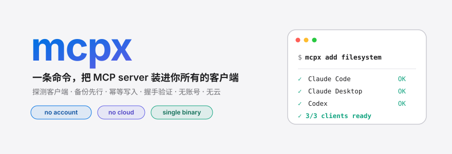
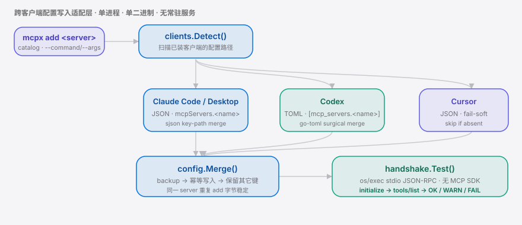

<div align="right"><sub><a href="./README.en.md">English</a>&nbsp;&nbsp;⇄&nbsp;&nbsp;<b>简体中文</b></sub></div>

<p align="center">
  <picture>
    <source media="(prefers-color-scheme: dark)" srcset="./assets/hero-dark.svg">
    <source media="(prefers-color-scheme: light)" srcset="./assets/hero-light.svg">
    
  </picture>
</p>

<p><sub>mcpx 是一条命令、无账号的 <b>MCP</b> 跨客户端本地安装器：探测客户端 → 写配置 → 握手验证。</sub></p>

<p align="center">
  <a href="./LICENSE"></a>
  
  <a href="https://github.com/SuperMarioYL/mcpx/actions/workflows/ci.yml"></a>
  
  
  
</p>

**给 agent 加一个 MCP server，今天还得为每个客户端手改一份不同的 JSON——`mcpx add <server>` 把它塌缩成一条命令，写进你所有的客户端，并逐一握手验证。**

<h2> 架构</h2>

一次 `mcpx add`：探测本机已装的 **Claude Code** / Claude Desktop / Codex / Cursor，按各家 schema（JSON key-path 或 TOML 表）**备份 → 幂等合并**，再起子进程走 stdio JSON-RPC 跑一次握手——全程单进程、单二进制、无常驻服务、不引 MCP SDK。

<p align="center">
  <picture>
    <source media="(prefers-color-scheme: dark)" srcset="./assets/atlas-dark.svg">
    <source media="(prefers-color-scheme: light)" srcset="./assets/atlas-light.svg">
    
  </picture>
</p>

<h2> 为什么需要它</h2>

MCP server 的供给侧已经很大（`awesome-mcp-servers` 90k★、`chrome-devtools-mcp` 45k★），但装进客户端这一步仍是手工活：每个客户端的**配置路径和 schema 都不一样**，Claude Code、Cursor、Codex 各写一遍、各自重启、还得祈祷它真的握手成功。`claude mcp add` 只解决 Claude Code 自己；价值集中在**同时用多个客户端**的人。mcpx 把 `5-6 步 × N 客户端` 收敛成一条本地命令——写前必备份、只动自己写的那一条、装完当场验证。

<h2> 快速开始</h2>

```bash
go install github.com/SuperMarioYL/mcpx/cmd/mcpx@latest   # 单二进制进 PATH（< 30s）
mcpx add filesystem                                        # 探测 → 备份 → 写入 → 握手
mcpx list                                                  # 确认每个客户端都装上了
```

<details>
<summary>实测输出（开发机，装了 3 个客户端）</summary>

```text
Detected 3 client(s): Claude Code, Claude Desktop, Codex
  · Cursor not detected (no config at ~/.cursor/mcp.json)

Installing filesystem (npx -y @modelcontextprotocol/server-filesystem .) into 3 client(s)
  Claude Code      backup → write → merged
                   backup: ~/.claude.json.mcpx.bak.20260704-112615.123
                   ✓ handshake OK (initialize + tools/list, 12 tools)
  Claude Desktop   backup → write → merged
                   ✓ handshake OK (initialize + tools/list, 12 tools)
  Codex            backup → write → merged
                   ✓ handshake OK (initialize + tools/list, 12 tools)

✓ 3/3 clients ready
Restart (or reload) the affected clients to pick up the new server.
```
</details>

<h2> 用法</h2>

```bash
# 从内置目录按名安装（备份 → 幂等写入 → 握手）
mcpx add filesystem

# 目录里没有的 server：显式给命令 / 参数 / 环境变量
mcpx add my-server --command npx --args '-y @my-scope/my-mcp-server' --env API_TOKEN=secret

# 只写指定客户端，跳过确认
mcpx add git --clients claude-code,codex --yes

# 先预览、不落盘
mcpx add fetch --dry-run

# 撤回——只删自己写的条目，备份仍在
mcpx remove filesystem

# 看内置目录
mcpx catalog
```

更多示例见 [`examples/quickstart.sh`](./examples/quickstart.sh)。

**子命令**：`add <server>` · `list` · `remove <server>`（别名 `rm`）· `catalog`
**全局参数**：`--clients c1,c2` · `--dry-run` · `--yes/-y` · `--version/-v` · `--help/-h`

<h2> Demo</h2>


<h2> 支持的客户端</h2>

| 客户端 | 配置文件 | 格式 | 状态 |
|---|---|---|---|
| Claude Code | `~/.claude.json` | JSON（`mcpServers.<name>`，含 `type:"stdio"`) | ✓ 实测 |
| Claude Desktop | `~/Library/Application Support/Claude/claude_desktop_config.json`（macOS） | JSON（`mcpServers`） | ✓ 实测 |
| Codex | `~/.codex/config.toml` | TOML（`[mcp_servers.<name>]`） | ✓ 实测 |
| Cursor | `~/.cursor/mcp.json` | JSON（`mcpServers`） | fail-soft：无配置则跳过 |

未探测到的客户端不会被猜测写入——mcpx 只对确证路径的客户端动手，其余在输出里明确标注跳过。

<h2> 对比</h2>

诚实定位，不吹。每个方案都有它做得更好的地方：

| 能力 | `mcpx` | `claude mcp add` | [awesome-mcp-servers](https://github.com/punkpeye/awesome-mcp-servers) | Smithery / mcp-get |
|---|:--:|:--:|:--:|:--:|
| 一条命令写进**所有**探测到的客户端 | ✓ | — (只 Claude Code) | — (目录) | 部分 (偏单点/注册表) |
| 装完跑 handshake 冒烟验证 | ✓ | — | — | — |
| 写前备份 + 幂等合并（不碰你的其它键） | ✓ | ✓ | n/a | 部分 |
| 本地、无账号、无云 | ✓ | ✓ | ✓ | 部分 (偏云/注册表) |
| server 发现 / 目录规模 | 内置 8 个 | — | ✓ **9 万★，无可比** | ✓ |

> 一句话：目录负责"存在什么"，各家 `add` 负责"写自己"，mcpx 负责"跨客户端写好并验证真的连得上"。

<h2> 定价</h2>

本地内核——探测、备份、跨客户端写配、握手——**永久开源、无付费墙**。付费只在"团队同步/审计"这一层：

| 版本 | 面向 | 价格 | 内容 |
|---|---|---|---|
| **OSS Core** | 个人开发者 | 开源免费 | 本节以上的全部能力 |
| **mcpx Teams** | 5–30 人工程团队 | **$5 / 坐席 / 月**（团队封顶 $49/月起，≤10 人） | 托管团队配置清单（"应装哪些 server + 版本"沉淀为共享 profile）、`mcpx add --profile <team>` 一键对齐、CI 校验每人配置符合团队 profile、审计日志 |

> Teams 是 v0.3+ 的后续楔子，v0.1 仅在此埋点、代码不实现。本地写配这一核心动作永不设墙。

<h2> 路线图</h2>

- [x] **m1** — `mcpx add`：探测 → 备份 → 幂等写入 → 握手，逐客户端 OK/WARN/FAIL
- [x] **m2** — `mcpx list` / `mcpx remove`（删前再备份，保留其它条目）
- [x] **m3** — 内置 8 server 目录 + `--command/--args/--env` 通用 from-spec；跨平台单二进制、中英 README、demo、CI
- [ ] 更多客户端适配器（国产 coding-agent 客户端路径确证后实装）
- [ ] `mcpx doctor`：巡检各客户端已装 server 的健康度
- [ ] **mcpx Teams**：共享 profile + CI gate + 审计（付费楔子）

<h2> 许可与贡献</h2>

Apache-2.0。欢迎 issue / PR——请附上你用了哪几个客户端、以及希望优先支持哪一个。

## Share this

```
mcpx — the one-command MCP installer that writes into every coding agent you have (Claude Code, Codex, Cursor) and handshake-verifies each. No account, no cloud. https://github.com/SuperMarioYL/mcpx
```

<p align="center"><sub><a href="./LICENSE">Apache-2.0</a> © 2026 SuperMarioYL</sub></p>
